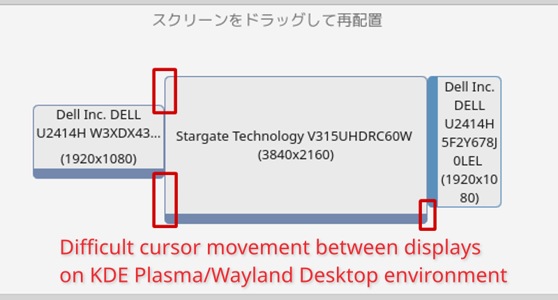
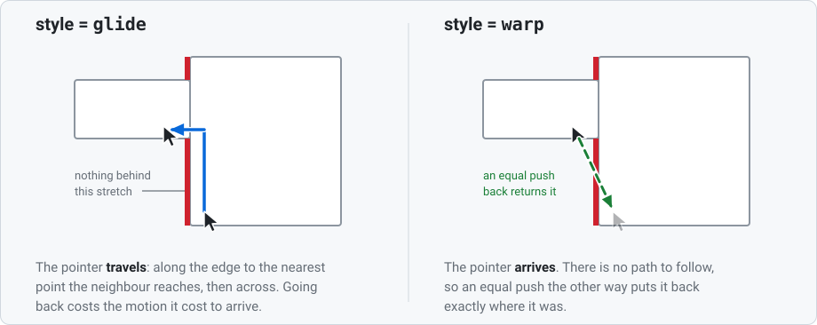

# wayland-cursor-smoother

[English](README.md)

非矩形なマルチディスプレイ配置にできた隙間を越えて、ポインタを滑らせます。
KDE Plasma / Wayland 向けです。

モニタがきれいな長方形に並んでいない場合、画面の縁には「その先に何もない」
区間ができます。ポインタがそこへ到達すると止まり、どれだけ押しても動きません。
行き先が存在しないからです。本プロジェクトはそれを見張り、ポインタを縁に沿って
滑らせて、隣のディスプレイの最も近い点へ送り出します。Windows 11 が
「ディスプレイ間でカーソルを簡単に移動させる」で行っているのと同じことです。

コンポジタの外で完結して動くため、ここにバグがあってもセッションが落ちることは
ありません。

> [!NOTE]
> **動作します。そして、実際に使われたマシンはちょうど1台です。**
>
> 開発と動作確認は Plasma 6.3.6 / KWin 6.3.6、Debian 13、カーネル 6.12、
> 縦置きを含む3枚のディスプレイという環境で行いました。意図して特定バージョンに
> 固定してはいませんが、KWin のスクリプティングAPIは安定性の約束ではないので、
> Plasma を上げたら「大丈夫だろう」と考えずに、下記のチェックを流し直す機会だと
> 捉えてください。
>
> お使いの環境で動かない場合、診断は組み込まれていて、鎖のどの環が切れているかを
> 教えます。[トラブルシューティング](#トラブルシューティング)を参照してください。



---

## これはあなたの問題ですか？

隣のモニタと接している縁に沿ってポインタをゆっくり動かし、それぞれの高さで
外向きに押してみてください。

- **しっかり押せば越える** → それは KWin のエッジバリアであって、本プロジェクトの
  対象ではありません。`~/.config/kwinrc` の `[EdgeBarrier]` セクションで
  `EdgeBarrier=0` と `CornerBarrier=false` を設定すれば終わりです。
  本プロジェクトは必要ありません。
- **どれだけ強く、あるいはゆっくり押しても、決して越えられない区間がある** →
  それは配置の問題です。その高さではモニタ同士が重なっておらず、行き先が
  存在しません。邪魔をしているものが何もないので、KWin のどの設定でも
  解決できません。本プロジェクトが直すのはこちらです。

スクリーンショットの赤い帯は後者です。

### `CornerBarrier` を見つけて、それが解決策だと思った場合

違います。そして、この問題を検索した人のほとんどがここで躓きます。KDE で
モニタ間にカーソルが引っかかる件を検索すると、次が見つかります。

```ini
# ~/.config/kwinrc
[EdgeBarrier]
CornerBarrier=false
EdgeBarrier=0
```

名前は症状と一致しますし、Plasma 6.1 で実際に導入されたものですし、画面間の
ポインタ移動を本当に制御していますし、適用すれば**挙動が目に見えて変わります**。
最後の点こそが、この罠を罠として成立させています。

どちらの設定も*意図的に*抵抗を加えるものです。`EdgeBarrier`（既定値100）は、
画面の縁を越えるまでにどれだけ押し込む必要があるかで、隣のモニタへ勢い余って
飛び出さないためにあります。`CornerBarrier` は出力の角から15px以内でこれを
2000pxまで引き上げ、ホットコーナーを確実に狙えるようにします。

これらを切ると、**ポインタにもともと行き先があった場所**の抵抗が消えます。
それは本当の改善であり、だからこそ人は解決したと信じます。そしてまた
デッドバンドにぶつかります。

**これらの設定では、存在しない画面領域を作り出すことはできません。** 抵抗を
取り除くことと、リダイレクトを加えることは別物で、後者だけがこの問題を解きます。

---

## 必要なもの

| | |
|---|---|
| デスクトップ | Wayland 上の KDE Plasma。本プロジェクトが使う機構に GNOME の相当物はありません |
| Python | 3.8 以上。中核は標準ライブラリのみ |
| パッケージ | デーモンに `python3-dbus` と `python3-gi`。`kscreen-doctor` と `qdbus`/`gdbus` は Plasma と一緒にほぼ確実に入っています |
| カーネル | `/dev/uinput` に自分が書き込めること（多くの場合すでに `0666`。そうでなければ `input` グループか udev ルール） |
| アクセス権 | ポインティングデバイスの `/dev/input/event*` ノードへの読み取り権限。[デバイスへのアクセス権](#2-デバイスへのアクセス権)を参照 |

Debian や Ubuntu では、2つの Python バインディングは次で入ります。

```bash
sudo apt install python3-dbus python3-gi
```

`./bin/wcsd --check` が `kscreen-doctor` を見つけられないと報告した場合、
お使いのディストリビューションが KScreen のコマンドラインツールを収めている
パッケージを入れてください。

---

## セットアップ

### 1. 何をするのか確認する

これは何も変更せず、デバイスも作らず、権限も要りません。

```bash
./bin/wcsd --check
```

画面配置、その先に何もない縁の区間すべて、それぞれの区間からポインタがどこへ
送られるか、そして読み取れるポインティングデバイスを表示します。デッドバンドの
一覧が、実際にポインタが引っかかる場所と一致しないなら、ここで止めてください。
それは別の問題です。

### 2. デバイスへのアクセス権

縁に*押し当てている*ことを検出するには、ポインティングデバイス自身の動作
イベントを読む必要があります。縁に貼り付いたポインタは、移動をまったく
報告しないからです。そのためには、そのデバイスの `/dev/input/event*` ノードへの
読み取り権限が要ります。

よくある案内は `input` グループに入ることです。**それは、あなたとして動く
あらゆるプロセスに、キーボードを含むすべての入力デバイスへの読み取り権限を
与えます。** 避けるに越したことはありません。

udev ルールならもっと絞れますが、真っ先に思いつく「絞ったルール」は誤りです。
`ATTRS{idVendor}`/`ATTRS{idProduct}` でのマッチは、精密に見えて精密では
ありません。これらの属性は USB デバイスのものであり、TrackPoint やトラックパッドを
内蔵したキーボードは、キーボードとポインタを*1つの*デバイスの2つの
インタフェースとして提示し、属性を共有します。つまりそのルールは、守ろうとした
はずのキーストロークを明け渡します。udev が各ノードをすでにどう分類したかで
マッチすれば、それを避けられ、しかもマウスを買い換えても生き残ります。

```bash
./tools/probe_evdev_access.py --write-rule
```

ルールを表示し、下書きファイルに書き出し、インストールするための3つのコマンドを
示します。このルールは、何かを許可する前に、まずキーボードとタグ付けされたものを
拒否します。実行後にプローブを流し直してください。2つのことを確認しますが、
2つめのほうが重要です。いずれかのポインティングデバイスが読めること、そして
**キーボードが1つも読めないこと**です。

```bash
./tools/probe_evdev_access.py --watch 20
```

実行中に、手元のポインティングデバイスをすべて動かしてください。どれも0でない
カウントを報告するはずです。黙ったままのものは、押し込みの検出には使えません。

### 3. 実行する

```bash
./bin/wcsd
```

デッドエッジに押し込むと、ポインタが隣のディスプレイへ滑り込みます。`--verbose`
を付けると、待機開始と待機解除も逐一記録されます。調整中はこちらが便利です。

### 4. セッションと一緒に起動する

このチェックアウト用の systemd ユーザユニットが生成できます。パスはすべて
埋まっているので、編集するところはありません。

```bash
./bin/wcsd --write-service                       # まず中身を読む
./bin/wcsd --write-service ~/.config/systemd/user/wayland-cursor-smoother.service
systemctl --user daemon-reload
systemctl --user enable --now wayland-cursor-smoother
journalctl --user -u wayland-cursor-smoother -f
```

ユニットについて、知っておく価値のあることが3つあります。

- **KWin を待ちます。** デーモンは読み込めなかったフィードスクリプトを報告しつつ
  動き続けるので、コンポジタより先にセッションバスへ着いてしまうと、健康そうに
  見えて何も受け取らないプロセスが残ります。ユニットは KWin のスクリプティング
  インタフェースが応答するまでブロックします。
- **リロードでディスプレイを読み直します。** モニタを並べ替えたあと、
  `systemctl --user reload wayland-cursor-smoother` で仮想ポインタを落とさずに
  デッドバンドを再計算します。これは後述の `SIGHUP` です。
- **セッションと一緒に停止し**、失敗した場合は再起動されます。

---

## 設定

ここには好みの問題が2つあり、どちらも議論では決着しないので、両方を設定項目に
してあります。どれくらい強く押す必要があるか、そしてポインタが飛ぶか移動するか、
です。



```bash
./bin/wcsd --write-config ~/.config/wayland-cursor-smoother.conf
```

組み込みの既定値をそのまま収めた、説明付きのファイルを書き出します。書き出した
ばかりのコピーは何も変えません。どの値もコマンドラインから与えられます。好みを
探している間はそちらのほうがずっと速いです。

```bash
./bin/wcsd --verbose --threshold 50        # 軽い押し込みで発火させる
./bin/wcsd --verbose --style warp          # Windows と同じく即座に飛ばす
./bin/wcsd --verbose --duration 0.15       # グライドをゆっくりにする
```

| 設定 | 既定値 | 何が変わるか |
|---|---|---|
| `threshold` | 100 | 押し込みとみなす外向きの移動量。単位は**ピクセルではなくデバイスカウント**です。両者の間にはポインタ加速が挟まるので、これが測っているのは手がどれだけ動いたかです。反応が鈍いと感じるなら下げ、縁に手を伸ばしただけのつもりでポインタがディスプレイを出ていくなら上げてください |
| `window` | 0.3 | 途中まで進んだ押し込みが忘れられるまでの秒数。上げると、何回かに分けて押せます |
| `cooldown` | 0.5 | リダイレクトのあと、次が発火できるようになるまでの秒数 |
| `style` | `glide` | `glide` は移動し、`warp` は即座に到着します。ワープは Windows の挙動で、コストもかかりませんが、数百ピクセルは目がポインタを見失うのに十分な距離です |
| `duration` | 0.08 | グライドにかかる秒数 |
| `rate` | 120 | グライド中に1秒あたり送出する位置の数 |
| `inset` | 2 | 移動先ディスプレイの内側何ピクセルに着地するか。好みではなく安全マージンです |
| `max_slide` | none | 縁に沿ってこれより長く滑らなければ届かない場合、リダイレクトを拒否します |
| `undo_window` | 3 | **ワープ**を、逆向きに `threshold` だけ押して取り消せる秒数。`off` で無効。`style = glide` では何もしません |

### ワープを取り消す

ポインタを使っているとき人が感じているのは、手がどれだけ動いたかであって、
ポインタがどこにあるかではありません。ポインタはほとんど見られておらず、
しばしば見失われます。だからこそデッドゾーンは直す価値があるのです。手は
動いたのに、ポインタは期待した場所にいないからです。

ワープには、同じ問題が裏側から現れます。頼んでいない場所にポインタが置かれると、
手は自分が作っていない変位を抱えることになり、押し戻しても取り消せません。
帰り道は、リダイレクトが滑っていった縁を回り込む迂回路だからです。

そこでワープは `undo_window` 秒のあいだ取り消せるままにしてあります。**逆向きに
`threshold` だけ押せば、ポインタは元いた場所へ正確に戻ります。** 同じだけの
運動量がそれを買い、そして買い戻します。ボタンを押すとこの申し出は取り消されます。
クリックしたということは、そこにいるつもりだったということだからです。

グライドにこれは要らず、与えてもいません。すでに帰り道を目の前で通ってみせて
おり、それを辿り直すコストは、来たときに払ったコストと同じだからです。

打ち間違えたキーは、黙って無視されるのではなくエラーになるので、何もしない設定は
その理由を教えます。`--check` も、取り消しが実際に有効かどうかを表示します。
`undo_window` は `glide` のもとでは不活性だからです。

設定を変えたら再起動が要ります。上のユニットを入れたなら
`systemctl --user restart wayland-cursor-smoother` です。`SIGHUP` はディスプレイ
配置だけを読み直すもので、`systemctl --user reload` が送るのがこれです。モニタを
並べ替えたあとに送ってください。

### 設定ファイルのコメント対訳

`--write-config` が書き出すファイルには、各項目の説明がコメントとして入って
いますが、そのコメントは英語だけです。以下はその内容の日本語版で、上の表より
詳しく書かれています。値を決めるときの判断材料はこちらにあります。正となるのは
書き出されたファイル自身で、ここはその読み替えです。

ファイルの冒頭には、こう書かれています。以下の値はすべて組み込みの既定値なので、
書き出したばかりのコピーは何も変えません。ある行を消せば、その項目は既定値に
戻ります。

**`[detect]` セクション**

**`threshold`**

ポインタがすでにデッドエッジに貼り付いている状態から、リダイレクトが発火する
までに、ポインティングデバイスが外向きにどれだけ動く必要があるか。
単位は**ピクセルではなくデバイスカウント**です。両者の間にはポインタ加速が挟まる
ため、固定の換算はありません。これが測っているのは、手がどれだけ動いたかです。
既定値は KWin 自身の `EdgeBarrier` 設定と同じ値なので、すでに慣れている抵抗感と
同じように感じられるはずです。反応が鈍いと感じるなら下げてください。縁に手を
伸ばしただけのつもりでポインタがディスプレイを出ていくなら上げてください。

**`window`**

外向きの動きが途絶えてから、途中まで進んだ押し込みが忘れられるまでの秒数。
上げると何回かに分けて押せるようになり、下げるとひと続きの動きだけが数えられます。

**`cooldown`**

リダイレクトのあと、次のリダイレクトが発火できないでいる秒数。

**`undo_window`**

ワープを、逆向きに `threshold` だけ押して取り消せる秒数。ポインタを使っている
とき人が感じているのは手がどれだけ動いたかであって、ポインタがどこにあるかでは
ありません。ですからワープが予期しない場所にポインタを置いたとき、人が手を
伸ばす修正動作は、同じだけ押し戻すことです。これがないとポインタは戻ってきません。
帰り道は、リダイレクトが滑っていった縁を回り込む迂回路だからです。
`off`（または0）で無効になります。**これは `style = warp` にのみ適用されます。**
グライドはすでに帰り道を見せており、それを辿り直すコストは来たときと同じなので、
取り消すものがありません。

**`[redirect]` セクション**

**`style`**

`glide` なら、ポインタは `duration` 秒かけて新しい位置まで移動します。`warp`
なら即座に到着し、これが Windows の挙動です。
ワープは正直でコストもかかりませんが、数百ピクセルは、目がポインタを見失って
探し直すのに十分な距離です。グライドは視界に留めます。どちらがよく感じられるかは
好みの問題なので、両方試してください。

**`duration`**

グライドにかかる秒数。`style = warp` では無視されます。ごく短い値はワープのように
振る舞い、ごく長い値はポインタが引きずられているように感じられます。

**`rate`**

グライド中に1秒あたり送出する位置の数。ポインタが横切るディスプレイの
リフレッシュレートを超えても、ほとんど意味はありません。

**`inset`**

移動先ディスプレイの内側何ピクセルに着地するか、をピクセルで指定します。外周の
縁ちょうどに着地することは、どのディスプレイにも属さない状態から1ピクセルの
距離にいるということなので、これは好みではなく小さな安全マージンです。

**`max_slide`**

隣へ届くために、縁に沿ってこのピクセル数より長く滑る必要がある場合、
リダイレクトを拒否します。空欄は無制限を意味します。長い滑りが、滑りというより
テレポートのように感じられるなら設定してください。

---

## 仕組み

```
KWin JS スクリプト（必要に応じてロードされる）
    Wayland クライアントからは見えないグローバルなポインタ位置を読み、
    デーモンが計算した縁の帯にポインタが乗っている間だけ報告する
        |
        |  D-Bus
        v
wcsd（KWin の外側）
    その間、ポインティングデバイスの外向きの押し込みを見張り、
    リダイレクトを /dev/uinput に書き込む
```

これを可能にしているものが3つあります。

**KWin スクリプトは、配置全体を基準としたポインタ位置を読めます。** Wayland
クライアントは設計上、サーフェスローカルな座標しか受け取りません。コンポジタの
内側で動くコードにその制限はありません。

**KWin スクリプトはポインタを動かせない**ので、外側の何かが動かす必要があります。
`/dev/uinput` 上の仮想**絶対**ポインタならそれができます。KWin は絶対ポインタの
イベントを*配置全体*のジオメトリに対してスケールするので、1つのイベントで
デスクトップ上の任意の場所にポインタを置けますし、絶対座標の移動はエッジバリアと
戦うのではなく素通りします。XTest と違い、uinput デバイスは libinput と KWin から
見れば普通の evdev デバイスなので、そのイベントを信頼できないものとして扱うものは
ありません。ポータルも介在しないので、許可ダイアログも通知も、カーソルが隠れることも
ありません。

これは1つの要件の上に成り立っています。**libinput がこの仮想デバイスを
ポインタとして分類しなければなりません。** 絶対軸があるだけでは足りず、タブレットや
タッチスクリーンにも見えるデバイスは単一のディスプレイに束縛され、ポインタを
動かしたい先のディスプレイには決して届きません。`ABS_X`/`ABS_Y` とマウスボタンを
宣言し、それ以外を宣言しないことが、ポインタの経路に乗せる条件です。VMware や
QEMU がゲストに見せている絶対 USB ポインタと同じ形です。

*（これは仮想デバイスに限った話です。普通のペンタブレットが1枚のディスプレイに
限定されるのは、それがタブレットだからであって、Wayland の座標がディスプレイ単位
だからではありません。この区別は取り違えやすく、取り違えると見当違いの方向に
気を落とすことになります。）*

**縁に到達することと、縁を押すことは同じではありません。** 貼り付いたポインタは
動かなくなるので、コンポジタには報告するものが残りません。接触だけでリダイレクト
すると、中央ディスプレイの左にあるものへ手を伸ばすたびに、ポインタが別の画面へ
飛んでいくことになります。そこで押し込みはデバイス自身から読みます。これは同時に、
カーソルを離散的なステップで動かすデバイス（アクセシビリティのために使われるものを
含みます）でも、マウスと同じように動かせるということでもあります。

デッドバンドのジオメトリは Python の1か所にあります。スクリプトには、点の内外を
判定するための素の矩形が渡されます。ポインタの着地点を決める規則が、2つの言語の
間でずれないようにするためです。

---

## トラブルシューティング

どの層にも、1つの問いに答えてそこで止まるプローブがあります。

```bash
./bin/wcsd --check                    # 配置、デッドバンド、読めるデバイス
./bin/wcsd --diagnose                 # 鎖を辿り、どの環が切れているかを言う
./tools/probe_uinput.py               # 仮想ポインタは全ディスプレイに届くか
./tools/probe_evdev_access.py         # 何が読めて、何が読めてはならないか
./tools/probe_kwin_feed.py            # KWin スクリプトはポインタを読めるか
./tools/probe_dbus_link.py            # そのスクリプトはデーモンを呼べるか
```

`--diagnose` は、デーモンがきれいに起動して何もしないときに手に取るものです。
トレースを有効にしてフィードを読み込むので、スクリプトが読み取った位置と計算した
帯を報告しますし、コンポジタのジャーナルも読み返してくれます。沈黙は診断では
ありません。これはそれを診断に変えます。

`tools/probe_uinput.py` は、デーモンをまったく動かさずに意図した挙動を見るのにも
最適です。各リダイレクトをアニメーションで見せ、一歩ずつ進むので、ポインタが
デッドエッジで止まり、それから隣へ滑り込むところを見ることができます。

### テスト

```bash
python3 -m unittest discover -s tests
```

標準ライブラリのみで、ディスプレイも要りません。配置の計算、着地の意味論、
押し込みの検出器、設定、生成されるフィードスクリプト、そして生の evdev イベント列を
網羅しています。

---

## 検討して見送った方法

**InputCapture ポータル。** 任意の位置にポインタを置けますし、そのポインタバリアは
まさに正しい条件で発火します。しかし xdg-desktop-portal-kde は**すべての**有効化の
たびに緊急度の高い通知を出します。見出しが *"Input Capture Started"*、その下の行が
*"<app> has taken over the pointer and keyboard"* です。さらに KWin はその間
カーソルを隠します。ここでの「有効化」は「利用者が角にぶつかった」という意味なので、
普通にデスクトップを使っているだけで、数秒おきにポップアップとカーソルの明滅が
起きることになります。問題そのものよりはるかにひどい状態です。

**RemoteDesktop ポータル。** 絶対座標でポインタを配置できますが、それには
ScreenCast ストリームが必要で、セッションが生きている限り画面共有インジケータが
立ち続けます。「画面が共有されています」という状態が恒久的に続くのは、割に合う
取引ではありません。（このインジケータは ScreenCast/RemoteDesktop のもので、
InputCapture のものではありません。2つは別々の理由で見送られています。）

**XTest / `xdotool`。** KWin は XTest で注入された入力を信頼できないものとして
扱い、本物の Wayland 入力パイプラインには流しません。

**Wayland の pointer-warp プロトコル。** KWin はワープ先を、現在ポインタフォーカスを
持つウィンドウのサーフェスに限定しているので、画面をまたげません。

**ツリー外の KWin プラグイン。** 技術的には最も素直な選択肢で、IPC を一切介さず
`warp()` を直接呼べます。見送った理由は、それがコンポジタの内側で、ポインタが動く
たびのイベントごとに走ることになり、そこでクラッシュするとセッションが落ちるから
です。その危険をコンポジタの外に置いておくことが、この設計がこういう形をしている
理由です。

---

## 適用範囲と制限

- **Wayland 上の KDE Plasma のみ。** ポインタ位置を読む側の仕組みには、私の知る
  限り他に相当物がありません。
- **KWin のスクリプティングAPIは安定性の約束ではありません。** Plasma の
  アップグレードでフィードが壊れることはあり得ます。上記のプローブがすぐに
  それを教えます。
- **異なるDPIが混在する配置は未検証です。** コードは一貫して KWin の論理座標で
  動いているので、スケールされたディスプレイでも扱えるはずですが、試せる実機が
  ありませんでした。開発に使ったマシンのディスプレイはすべて `Scale: 1` を報告
  します。スケールされたディスプレイでおかしな動きをするなら、それは報告する
  価値のある不具合です。

理想を言えばこんなものは必要なく、不連続な配置に対してコンポジタが素直に正しく
振る舞ってくれればよいのです。これが不要になる日が来るなら、喜ばしいことです。

## ほかの選択肢

ポインタが引っかかるという理由でここに辿り着いたのなら、次のいずれかのほうが
本プロジェクトより合うかもしれません。

**[MouseUnSnag](https://github.com/MouseUnSnag/MouseUnSnag)** は Windows 10 上で
同じ仕事をします。揃っていない配置のせいでポインタの行き先がなくなったときに、
向こう側へ動かしてくれます。

**[Little Big Mouse](https://github.com/mgth/LittleBigMouse)** は別の問題のための
ものですが、ディスプレイごとに画素密度が違うなら知っておく価値があります。
ディスプレイ間を越えるときに、対応するピクセル行ではなく*物理的に*どこへ着地するか、
を扱うものです。Windows で動き、新しい Linux バックエンドは KDE Plasma 6 Wayland
上で開発されています。

**Windows 11 にはこれが組み込まれています。** 「ディスプレイ間でカーソルを簡単に
移動させる」（英語版では *Ease cursor movement between displays*）という名前で、
設定 → システム → ディスプレイ → 複数のディスプレイ にあり、ビルド 22557 以降で
使えます
([elevenforum](https://www.elevenforum.com/t/turn-on-or-off-ease-cursor-movement-between-displays-in-windows-11.4873/))。
本プロジェクトが再現しようとしているのは、この挙動です。オン/オフの切り替えだけで
調整するものはなく、配置によっては押し込みではなく接触で越えることがあります
([Microsoft Community Hub](https://techcommunity.microsoft.com/discussions/windowsinsiderprogram/windows-11-multi-monitor-issue---cursor-jumps-to-closest-corner-of-above-monitor/3699709))。

よく似た2つの問題が一緒に語られがちです。次のスレッドにある図が、その違いを
うまく見せてくれます。

- [How to disable sticky corners in Windows 10](https://superuser.com/questions/947817/how-to-disable-sticky-corners-in-windows-10):
  角における意図的な抵抗。**本プロジェクトの問題ではありません。**
- [How to make the mouse wrap from corners when moving between monitors?](https://superuser.com/questions/865469/how-to-make-the-mouse-wrap-from-corners-when-moving-between-monitors):
  その先に何もない縁の区間。**こちらが本プロジェクトの問題です。**

## ライセンス

[LICENSE](LICENSE) を参照してください。
