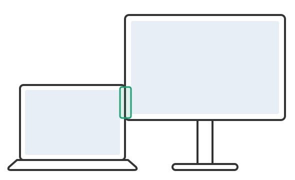
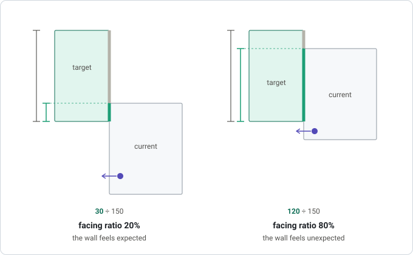

# wayland-cursor-smoother

[日本語](README.ja.md)

Slide the pointer past the gaps in a non-rectangular multi-display layout, on
KDE Plasma / Wayland.

If your monitors do not line up into a clean rectangle, there are stretches of
screen edge with nothing behind them. The pointer reaches one of those and
stops, and no amount of pushing moves it, because there is nowhere for it to
go. This watches for that, and slides the pointer along the edge onto the
nearest point of the neighbouring display. Windows 11 does the same thing
under *Ease cursor movement between displays*.

It runs entirely outside the compositor, so a bug here cannot take down your
session.

> [!NOTE]
> **It works, and it has been used on exactly one machine.**
>
> Developed and run on Plasma 6.3.6 / KWin 6.3.6, Debian 13, kernel 6.12, with
> three displays including a portrait one. Nothing here is version-locked on
> purpose, but KWin's scripting API is not a stability promise, so treat a
> Plasma upgrade as a reason to re-run the checks below rather than to assume.
>
> If it does not work on your setup, the diagnostics are built in and say
> which link of the chain is broken. See [Troubleshooting](#troubleshooting).


---

## Is this your problem?

Run the pointer slowly along the edge shared with the next monitor, pushing
outward at each height:

- **It crosses once you push firmly** → that is KWin's edge barrier, not this.
  Set `EdgeBarrier=0` and `CornerBarrier=false` under `[EdgeBarrier]` in
  `~/.config/kwinrc` and you are done. You do not need this project.
- **There is a stretch where it never crosses, however hard or slowly you
  push** → that is geometry. Your monitors do not overlap at those heights, so
  there is no destination. No KWin setting can help, because nothing is in the
  way. That is what this fixes.

The red bands in the screenshot are the second kind.

### If you found `CornerBarrier` and thought that was the fix

It is not, and this trips up nearly everyone who searches for this problem.
Search for a stuck cursor between KDE monitors and you will find:

```ini
# ~/.config/kwinrc
[EdgeBarrier]
CornerBarrier=false
EdgeBarrier=0
```

The names match the symptom, Plasma 6.1 did introduce them, they genuinely do
govern pointer movement between screens, and applying them **visibly changes
the behaviour**. That last part is exactly what makes the trap work.

Both settings add resistance *on purpose*. `EdgeBarrier` (default 100) is how
far you must push past a screen edge before crossing, so you do not overshoot
onto the next monitor by accident. `CornerBarrier` raises that to 2000px
within 15px of an output corner, so hot corners stay reliably hittable.

Turning them off removes resistance **where the pointer already had somewhere
to go**. That is a real improvement, and it is why people believe they have
solved it. Then they hit the dead band again.

**These settings cannot create screen area that does not exist.** Removing
resistance is not the same as adding redirection, and only the second one
solves this.

---

## Requirements

| | |
|---|---|
| Desktop | KDE Plasma on Wayland. There is no GNOME equivalent of the mechanism this uses |
| Python | 3.8 or newer, standard library only for the core |
| Packages | `python3-dbus` and `python3-gi` for the daemon. `kscreen-doctor` and `qdbus`/`gdbus` are almost certainly already installed with Plasma |
| Kernel | `/dev/uinput` writable by you (often already `0666`; otherwise the `input` group or a udev rule) |
| Access | read access to your pointing device's `/dev/input/event*` node. See [Device access](#2-device-access) |

On Debian or Ubuntu the two Python bindings are:

```bash
sudo apt install python3-dbus python3-gi
```

If `./bin/wcsd --check` reports that `kscreen-doctor` is missing, install
whichever package your distribution ships KScreen's command line tool in.

---

## Setup

### 1. Check what it would do

This changes nothing, creates no device and needs no permissions:

```bash
./bin/wcsd --check
```

It prints your layout, every stretch of edge with nothing behind it, where the
pointer would be sent from each, and which pointing devices it can read. If
the list of dead bands does not match the places your pointer actually gets
stuck, stop here. Your problem is a different one.

### 2. Device access

Detecting that you are *pushing* against an edge means reading your pointing
device's own motion events, because a pinned pointer reports no movement at
all. That needs read access to its `/dev/input/event*` node.

The usual advice is to join the `input` group. **That grants read access to
every input device, your keyboard included, to anything running as you.** It
is worth avoiding.

A udev rule can be narrower, but the obvious narrow rule is the wrong one:
matching `ATTRS{idVendor}`/`ATTRS{idProduct}` looks precise and is not. Those
attributes belong to the USB device, and a keyboard with an integrated
TrackPoint or trackpad presents its keyboard and its pointer as two interfaces
of *one* device sharing them, so such a rule hands over the keystrokes it was
written to protect. Matching what udev has already classified each node as
avoids that, and survives replacing the mouse:

```bash
./tools/probe_evdev_access.py --write-rule
```

That prints the rule, writes it to a staging file and gives you the three
commands to install it. The rule refuses anything tagged as a keyboard before
it grants anything at all. Re-run the probe afterwards: it checks two things,
and the second matters more than the first. Some pointing device must be
readable, and **no keyboard may be**.

```bash
./tools/probe_evdev_access.py --watch 20
```

Move every pointing device you own while that runs. Each should report a
non-zero count; one that stays silent cannot drive a push.

### 3. Run it

```bash
./bin/wcsd
```

Push into a dead edge and the pointer slides onto the neighbour. `--verbose`
logs each arm and disarm as well, which is what you want while tuning.

### 4. Start it with your session

A systemd user unit is generated for this checkout, with every path already
filled in, so there is nothing to edit:

```bash
./bin/wcsd --write-service                       # read it first
./bin/wcsd --write-service ~/.config/systemd/user/wayland-cursor-smoother.service
systemctl --user daemon-reload
systemctl --user enable --now wayland-cursor-smoother
journalctl --user -u wayland-cursor-smoother -f
```

Three things in the unit are worth knowing about:

- **It waits for KWin.** The daemon reports a feed script it could not load
  and keeps running, so a start that beats the compositor to the session bus
  leaves a process that looks healthy and receives nothing. The unit blocks
  until KWin's scripting interface answers.
- **Reload re-reads your displays.** After rearranging monitors,
  `systemctl --user reload wayland-cursor-smoother` recomputes the dead bands
  without dropping the virtual pointer. That is `SIGHUP`, described below.
- **It stops with your session**, and is restarted if it fails.

---

## Configuration

Two things here are matters of taste and neither can be settled by argument,
so both are settings: how hard you have to push, and whether the pointer
jumps or travels.


```bash
./bin/wcsd --write-config ~/.config/wayland-cursor-smoother.conf
```

That writes a documented file holding exactly the built-in defaults, so a
fresh copy changes nothing. Every value can also be given on the command line,
which is much faster while you are finding what you like:

```bash
./bin/wcsd --verbose --threshold 50        # fire on a lighter push
./bin/wcsd --verbose --style warp          # jump instantly, as Windows does
./bin/wcsd --verbose --duration 0.15       # a slower glide
```

| Setting | Default | What it changes |
|---|---|---|
| `threshold` | 100 | Outward travel that counts as a push, in **device counts, not pixels**. Pointer acceleration sits between the two, so what this measures is how far your hand moved. Lower it if the feature feels unresponsive; raise it if the pointer leaves a display when you only meant to reach its edge |
| `window` | 0.3 | Seconds before a part-finished push is forgotten. Raise it to push in separate shoves |
| `cooldown` | 0.5 | Seconds after a redirect before another can fire |
| `style` | `glide` | `glide` travels; `warp` arrives instantly. A warp is what Windows does and costs nothing, but a few hundred pixels is far enough that the eye loses the pointer |
| `duration` | 0.08 | Seconds a glide takes |
| `rate` | 120 | Positions emitted per second while gliding |
| `inset` | 2 | Pixels inside the destination display to land. A safety margin, not a preference |
| `max_slide` | none | Refuse to redirect when the pointer would have to slide further than this along an edge |
| `min_facing` | 0 | Do not redirect at an edge whose facing ratio is lower than this, in percent. 0 redirects every dead band. See [the next section](#a-hypothesis-about-when-a-wall-feels-expected) |
| `undo_window` | off | Seconds after a **warp** during which moving `threshold` the other way puts the pointer back exactly where it was. Read [Going back](#going-back) before you turn it on. It does nothing under `style = glide` |

### A hypothesis about when a wall feels expected

Some people want a feature like Windows 11's *Ease cursor movement between
displays* so much that they install a separate tool for it. Other people find
the same feature annoying. This may be more than a matter of taste. It may be
about how the display layout shapes what people expect. This section explains
that hypothesis, and the `min_facing` setting that is based on it.



A common example is a laptop with an external monitor. The two screens differ
in height, so the part where the pointer can move between them (the green
frame in the picture) is sometimes narrow, and moving across is a bit of
work. Even so, people rarely seem to want the pointer to pass the wall (the
stretch of edge with nothing behind it) in this setup. It is clear where the
pointer crosses to the next screen, so there is not much to get confused
about.

What feels like "getting stuck" is a gap between where you think the next
screen is and where the pointer actually goes. That gap may be the real need
behind tools like this one. The other way round also holds. If the pointer
easily passes a wall that you expected to be there, that is a gap too, and it
feels wrong as well. This may be why people disagree about the feature.

So when do people feel that a wall naturally belongs there? This project uses
a number called the facing ratio as a clue.

- The **target display** is the display you are moving the pointer to.
- On the target display, take the edge that faces the display the pointer is
  on now. The part of that edge that actually touches the current display is
  the **opening**. The pointer moves between the two displays through it.
- The **facing ratio** is how much of that edge the opening covers.

When the facing ratio is low, the wall feels expected. As it gets higher, the
wall feels more and more like an unexpected obstacle. That is the hypothesis.



In both examples, the edge of the target display is 150 long. The dark green
line is the opening. The grey line is the rest of that edge, where nothing is
beside it. The purple dot is the pointer on the current display, pushed
against a stretch of its edge with nothing behind it.

- On the left, only 30 of 150 touches, so the facing ratio is 20%. The target
  display sits mostly off to the side, and a wall is what you would expect to
  see.
- On the right, 120 of 150 touches, so the facing ratio is 80%. The target
  display is almost straight ahead, but the pointer still stops at a wall.

With three or more monitors, one desk can have both expected and unexpected
walls. The `min_facing` setting lets you choose between them.

Set `min_facing` to the **lowest** facing ratio, in percent, at which this
project redirects. At an edge with a facing ratio at or above it, the pointer
is redirected. Below it, nothing happens, and the pointer stops at the wall as
it would without this project. For example, at 50%, the left example above
(20%) is not redirected, and the right one (80%) is. The default is 0, which
redirects every dead band.

### Going back

A redirect starts at a stretch of edge with nothing behind it. But it lands
where the two displays meet, so there is no wall on the way back. Move the
pointer back and it crosses over, as it does at any edge the two displays
share. You do not have to push.

It comes back at the end of the dead stretch, not at the exact point it left
from. The distance between the two is how far the redirect slid along the
edge. This is the same for `glide` and `warp`.

For a warp, `undo_window` can close that gap. For that many seconds after a
warp, moving `threshold` counts the other way puts the pointer back exactly
where it was. A button press cancels it, because clicking means you meant to
be there.

**It is off by default, because it does not check where the pointer is.** Any
movement back counts, anywhere on the screen. So a small correction in the
middle of the other display can send the pointer back across, when you only
meant to work there.

A mistyped key is an error rather than something silently ignored, so a
setting that does nothing will tell you why. `--check` also prints whether the
undo is actually active, since `undo_window` is inert under `glide`.

Changing the config needs a restart. Run `systemctl --user restart
wayland-cursor-smoother` if you installed the unit above. `SIGHUP` re-reads
the display layout only, and is what `systemctl --user reload` sends; send it
after rearranging your monitors.

---

## How it works

```
KWin JS script          reads the global pointer position, which no Wayland
   (loaded on demand)   client can see, and reports only while the pointer is
        |               on one of the edge strips the daemon computed for it
        |  D-Bus
        v
wcsd                    watches your pointing device for outward push while
   (outside KWin)       that lasts, and writes the redirect to /dev/uinput
```

Three things make it possible.

**A KWin script can read the pointer's layout-global position.** A Wayland
client only ever receives surface-local coordinates, by design. Code inside
the compositor does not have that limit.

**A KWin script cannot move the pointer**, so something outside has to. A
virtual **absolute** pointer on `/dev/uinput` can: KWin scales an absolute
pointer event against the geometry of the *whole* layout, so one event places
the pointer anywhere on the desktop, and absolute motion skips the edge
barrier rather than fighting it. Unlike XTest, a uinput device is an ordinary
evdev device as far as libinput and KWin are concerned, so nothing treats its
events as untrusted. No portal is involved, so there is no permission dialog,
no notification and no hidden cursor.

That rests on one requirement: **libinput has to classify the virtual device
as a pointer.** Absolute axes alone are not enough; a device that also looks
like a tablet or a touchscreen is bound to a single display and can never
reach the one the pointer is meant to move to. Declaring `ABS_X`/`ABS_Y` and a
mouse button and nothing else is what puts it on the pointer path. That is the
same shape as the absolute USB pointers VMware and QEMU present to guests.

*(This is only about a virtual device. An ordinary graphics tablet is confined
to one display because it is a tablet, not because Wayland's coordinates are
per-display. That distinction is easy to get backwards and discouraging in the
wrong direction if you do.)*

**Reaching the edge is not the same as pushing against it.** A pinned pointer
stops moving, so the compositor has nothing left to report; redirecting on
contact alone would fling the pointer to another screen every time you reached
for something at the left of your centre display. The push is therefore read
from the device itself, which also means a device that moves the cursor in
discrete steps, including ones people use for accessibility, drives it just
as well as a mouse does.

The dead-band geometry lives in one place, in Python. The script is handed
plain rectangles to test a point against, so the rule that decides where the
pointer lands cannot drift between two languages.

---

## Troubleshooting

Every layer has a probe that answers one question and stops guessing at the
next.

```bash
./bin/wcsd --check                    # layout, dead bands, readable devices
./bin/wcsd --diagnose                 # walk the chain, say which link is broken
./tools/probe_uinput.py               # can a virtual pointer reach every display?
./tools/probe_evdev_access.py         # what can be read, and what must not be
./tools/probe_kwin_feed.py            # can a KWin script read the pointer?
./tools/probe_dbus_link.py            # can that script call the daemon?
```

`--diagnose` is the one to reach for when the daemon starts cleanly and does
nothing. It loads the feed with tracing on, so the script reports the position
it read and the band it computed, and it reads the compositor's journal back
to you. A silence is not a diagnosis; that turns it into one.

`tools/probe_uinput.py` is also the best way to see the intended behaviour
without running the daemon at all: it animates each redirect, stepping so you
can watch the pointer stop at a dead edge and then slide onto the neighbour.

### Tests

```bash
python3 -m unittest discover -s tests
```

Standard library only, no display needed. They cover the layout maths, the
landing semantics, the push detector, the settings, the generated feed script
and the raw evdev event stream.

---

## Approaches investigated and rejected

**The InputCapture portal.** It can place the pointer at an arbitrary position
and its pointer barriers even trigger on exactly the right condition. But
xdg-desktop-portal-kde raises a high-urgency notification on **every**
activation, headed *"Input Capture Started"* above the line *"<app> has taken
over the pointer and keyboard"*, and KWin hides the cursor for the duration.
Here "activation" means "the user bumped a corner", so normal desktop use
would produce a popup and a cursor blink every few seconds, which is far worse
than the problem.

**The RemoteDesktop portal.** It can position the pointer absolutely, but only
alongside a ScreenCast stream, which raises the screen-sharing indicator for
as long as the session lives. A permanent "your screen is being shared" state
is not a reasonable trade. (That indicator belongs to ScreenCast/RemoteDesktop,
not to InputCapture. The two are rejected for different reasons.)

**XTest / `xdotool`.** KWin treats XTest-injected input as untrusted and does
not feed it into the real Wayland input pipeline.

**The Wayland pointer-warp protocol.** KWin restricts warping to surfaces of
the window that currently holds pointer focus, so it cannot cross screens.

**An out-of-tree KWin plugin.** Technically the cleanest option, since it could
call `warp()` directly with no IPC at all. Rejected because it would run inside
the compositor on every pointer motion event, and a crash there takes down the
session. Keeping that risk out of the compositor is why the design looks the
way it does.

---

## Scope and limitations

- **KDE Plasma on Wayland only.** The pointer-position half has no equivalent
  elsewhere that I know of.
- **KWin's scripting API is not a stability promise.** A Plasma upgrade may
  break the feed; the probes above will say so immediately.
- **Mixed-DPI layouts are untested.** The code works in KWin's logical
  coordinates throughout, which should be all a scaled display needs, but
  there was none to try it on: every display on the development machine
  reports `Scale: 1`. If a scaled display behaves oddly, that is a bug worth
  reporting.

Ideally none of this would be necessary and a compositor would simply do the
right thing at a discontinuous layout. I would be glad to see this become
redundant.

## Alternatives

If you are here because your pointer gets stuck, one of these may suit you
better than this project does.

**[MouseUnSnag](https://github.com/MouseUnSnag/MouseUnSnag)** does the same job
on Windows 10: it moves the pointer across when a misaligned layout has left it
nowhere to go.

**[Little Big Mouse](https://github.com/mgth/LittleBigMouse)** is for a
different problem, worth knowing about if your displays differ in pixel
density: where the pointer lands *physically* when it crosses between them,
rather than at the matching pixel row. It runs on Windows, and its newer Linux
backend is developed on KDE Plasma 6 Wayland.

**Windows 11 has this built in**, as *Ease cursor movement between displays*
under Settings → System → Display → Multiple displays, since build 22557
([elevenforum](https://www.elevenforum.com/t/turn-on-or-off-ease-cursor-movement-between-displays-in-windows-11.4873/)).
It is the behaviour this project set out to reproduce. It is a single on/off
setting with nothing to tune, and on some layouts it crosses on contact rather
than on a push ([Microsoft Community
Hub](https://techcommunity.microsoft.com/discussions/windowsinsiderprogram/windows-11-multi-monitor-issue---cursor-jumps-to-closest-corner-of-above-monitor/3699709)).

Two problems that look alike get discussed together, and these threads have the
pictures that tell them apart:

- [How to disable sticky corners in Windows 10](https://superuser.com/questions/947817/how-to-disable-sticky-corners-in-windows-10):
  deliberate resistance at a corner. **Not this project's problem.**
- [How to make the mouse wrap from corners when moving between monitors?](https://superuser.com/questions/865469/how-to-make-the-mouse-wrap-from-corners-when-moving-between-monitors):
  a stretch of edge with nothing behind it. **That one is.**

## Licence

See [LICENSE](LICENSE).
